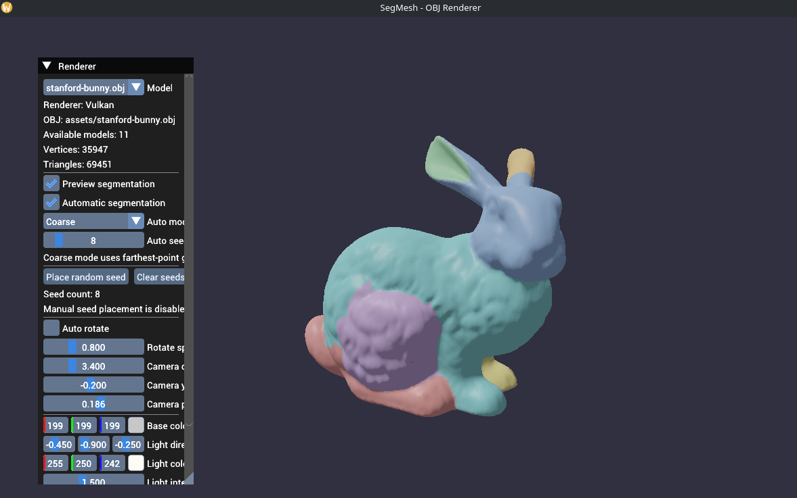
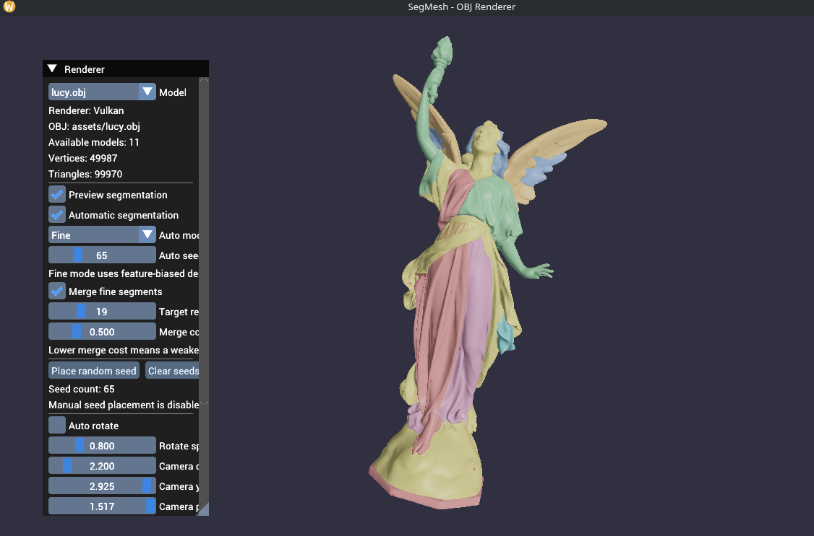

# SegMesh

SegMesh is a C++20 mesh viewer and segmentation prototype for experimenting with the random-walk mesh segmentation method described in:

Y.-K. Lai, S.-M. Hu, R. R. Martin, P. L. Rosin, *Rapid and Effective Segmentation of 3D Models Using Random Walks*, Computer Aided Geometric Design 26 (2009) 665-679.

The project loads triangle meshes from `.obj`, builds face adjacency and per-face geometry on the CPU, solves segmentation on the face graph with Eigen sparse linear algebra, and renders both the source mesh and segmentation preview with bgfx.

## What the project does

1. Load an `.obj` mesh with OpenMesh.
2. Normalize geometry and extract:
   - vertices and triangle indices
   - per-face centroids
   - per-face normals
   - face-to-face adjacency
   - shared-edge lengths
   - a simple convex/concave scale
3. Build a face graph where each triangle is a node.
4. Choose seed triangles:
   - manually
   - automatically with coarse seeding
   - automatically with fine seeding
5. Solve the random-walk segmentation on the CPU.
6. Optionally merge fine oversegmented regions.
7. Render the result with one color per segment.

### Manual segmentation

You place seed triangles manually, then the random-walk solver labels all remaining faces by the seed they most likely reach first.

### Automatic coarse segmentation

This mode is intended for larger structural parts.

It currently uses:
- geodesic-style farthest-point seed selection on the face graph
- one seed per connected component minimum
- random-walk solve after seed placement

This corresponds to the paper's coarse-scale seeding idea from Sec. 4.1.




### Automatic fine segmentation

This mode is intended to intentionally oversegment the mesh first.

It currently uses:
- many more seeds than coarse mode
- a feature-biased dense seeding heuristic
- random-walk solve
- optional region merging

The fine seeding stage is inspired by Sec. 4.2, but it is still an approximation of the paper's feature-sensitive particle distribution.



### Fine-mode merging

Fine mode can apply an iterative merge pass after random-walk segmentation.

The merge stage:
- computes boundary statistics between adjacent segments
- assigns a relative merge cost
- repeatedly merges the lowest-cost adjacent pair
- stops when:
  - the target region count is reached, or
  - the best remaining merge cost exceeds the chosen threshold

This is based on Sec. 4.2.2 of the paper.

## Dependencies

### Submodules used by the project

The repository expects these git submodules:
- `bgfx`
- `bx`
- `bimg`
- `glfw`

### System packages

You need these available to CMake:
- CMake 3.20+
- a C++20 compiler
- Eigen3
- OpenMesh
- pkg-config
- Wayland client development headers/libraries

On Linux this project currently assumes a Wayland runtime path in the renderer. The current renderer initialization in [renderer.cpp](/home/csabi/Documents/Önlab/SegMesh/src/renderer.cpp) explicitly requires Wayland handles.

### bgfx build outputs

This project does not build bgfx itself from scratch inside the main CMake target graph. It expects prebuilt bgfx libraries and `shaderc` to exist under a bgfx build output directory.

`CMakeLists.txt` tries to auto-detect:
- `libbgfx*.a`
- `libbx*.a`
- `libbimg*.a`
- `shaderc`

If auto-detection fails, pass:

```bash
-DBGFX_BIN_DIR=/full/path/to/submods/bgfx/.build/<platform>/bin
```

## Build

### 1. Fetch submodules

```bash
git submodule update --init --recursive
```

### 2. Build bgfx and make sure its binaries exist

This project expects the bgfx static libraries and `shaderc` executable to be available before configuring the main project.

If they are not in a location that CMake can auto-detect, provide `BGFX_BIN_DIR`.

### 3. Configure and build

Using the helper script:

```bash
./scripts/build.sh
```

## Run

Run with the first OBJ found under `assets/`:

```bash
./build/segmesh
```
